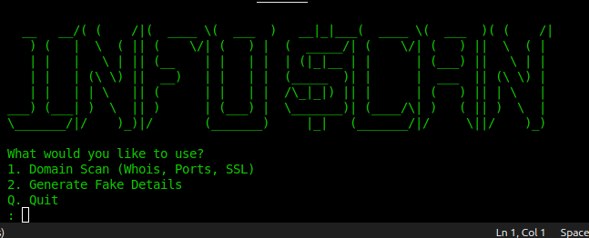
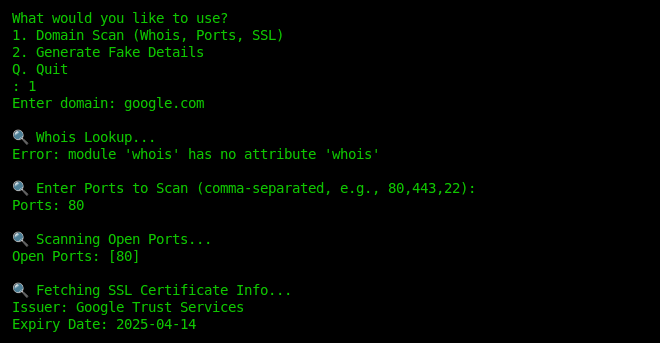

# InfoScan2 - Advanced Reconnaissance Tool 🚀


## Note the password to extract the zip file , is "sovit"
password = "sovit"

## Overview
Gather domain insights or generate fake data in seconds. Meet **InfoScan2**, the new and improved version of InfoScan with enhanced features, making it your ultimate reconnaissance assistant.





## Features
✅ Advanced domain scanning using WHOIS lookup  
✅ Fake data generation with Faker  
✅ Subdomain enumeration  
✅ Improved performance and accuracy  
✅ User-friendly CLI interface  
✅ Open-source and customizable  


## Installation
```bash
# 1️⃣ Update system & install Python3 and pip (if not installed)
sudo apt update && sudo apt install -y python3 python3-pip python3-venv

# 2️⃣ Create a virtual environment (Recommended)
python3 -m venv infoscan_env

# 3️⃣ Activate the virtual environment
source infoscan_env/bin/activate

# 4️⃣ Install required Python modules
pip install whois faker

# 5️⃣ Run InfoScan
python infoscan.py

# 6️⃣ (Optional) Deactivate virtual environment after use
deactivate
```

## Usage

# Scan a domain
python infoscan2.py --domain example.com

# Generate fake data
python infoscan2.py --fake
```

## Contributing
Created and developed by Sovit Jung Rijal with some help of AI in the port and SSL modules .


## License
Open Source 

## Contact
https://linktr.ee/sovit.jung.rijal

https://linktr.ee/sovit.jung.rijal
